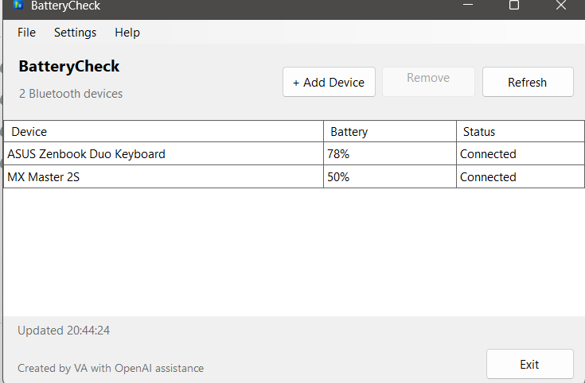

# BatteryCheck

BatteryCheck is a lightweight Windows desktop utility for viewing Bluetooth device battery levels in a compact, widget-like window.

## Screenshot

## Current Features

- Lists Bluetooth devices already paired with Windows.
- Shows connection state as **Connected** or **Paired**.
- Shows a simple battery percentage when a device exposes the standard Bluetooth Low Energy Battery Service.
- Displays **Unavailable** when Windows cannot provide a standard battery level.
- Manual refresh and configurable automatic refresh.
- **+ Add Device** scans for nearby unpaired Bluetooth devices and uses the normal Windows pairing process.
- **Remove Device** allows a selected paired Bluetooth device to be unpaired from Windows.
- Optional **Start BatteryCheck with Windows** setting.
- Optional window size and position persistence.
- **Create Desktop Shortcut** option in Preferences.
- Custom BatteryCheck application icon.
- First-run disclaimer requiring acceptance before the application opens.
- Normal desktop-window behavior with no tray-only operation.
- No telemetry and no advertising.

## Bluetooth Battery Compatibility

Bluetooth battery reporting is not standardized across every device.

BatteryCheck reads battery information when a device exposes the standard Bluetooth Low Energy Battery Service to Windows. Some headphones, keyboards, mice, game controllers, and other Bluetooth devices use proprietary battery-reporting mechanisms.

For those devices, BatteryCheck may display **Unavailable** even when Windows or the manufacturer's software can display a battery percentage.

BatteryCheck intentionally avoids aggressive GATT probing of connected devices because such probing can interfere with some Bluetooth peripherals. The normal refresh process uses cached standard battery information for devices Windows reports as connected.

## Requirements

### Running BatteryCheck

- Windows 11 recommended.
- Windows 10 build 19041 or later is the project target.
- Compatible Windows Bluetooth hardware.

The published Windows x64 release is **self-contained**, so users of the packaged release do not need to install the .NET 9 runtime separately.

### Building From Source

- .NET 9 SDK.
- Visual Studio 2022 with the .NET desktop development workload, or the `dotnet` CLI.

## Running the Application

Download the Windows x64 release and run:

`BatteryCheck.exe`

On first launch, BatteryCheck displays its disclaimer. The application starts after the disclaimer is accepted.

BatteryCheck does not require installation for the portable release.

A desktop shortcut can be created from:

**Settings > Preferences > Create Desktop Shortcut**

Because the portable application is not installed, move `BatteryCheck.exe` to its intended permanent location before creating a desktop shortcut. Moving the EXE afterward can cause an existing shortcut to stop working.

## Build From Source

1. Clone or download the repository.
2. Open `BatteryCheck.slnx` in Visual Studio.
3. Build the solution.
4. Run the `BatteryCheck` project.

## Privacy

BatteryCheck stores its preferences locally under the current user's local application-data folder.

BatteryCheck does not transmit Bluetooth device information or usage data and contains no telemetry or advertising.

## Disclaimer

BatteryCheck is provided for use at the user's discretion. Bluetooth behavior can vary depending on Windows, Bluetooth hardware, drivers, and connected devices.

The application presents a more detailed disclaimer on first launch. Acceptance is required before continuing into the application.

## Known Limitations

- Battery percentages are unavailable for Bluetooth devices that do not expose a compatible standard battery service to Windows.
- Windows may require its normal confirmation or authentication process when pairing Bluetooth devices.
- Bluetooth behavior can vary between hardware, drivers, Windows versions, and device manufacturers.
- The portable desktop shortcut points to the location of `BatteryCheck.exe` at the time the shortcut is created.

## License

MIT. See `LICENSE`.

## Version

BatteryCheck v0.9.0

This is a pre-1.0 release intended for real-world testing and feedback before a future v1.0 release.

## Credits

Created by VA with OpenAI assistance.
